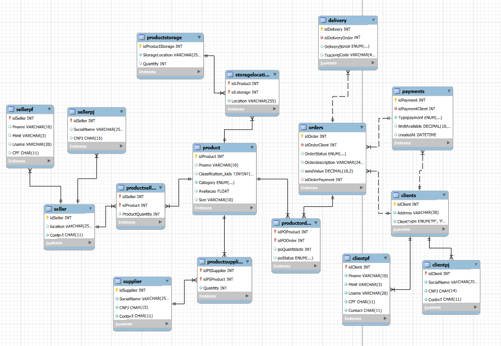

# 🛒 E-commerce — Projeto Lógico de Banco de Dados (MySQL)

Projeto desenvolvido como parte de um desafio de modelagem e implementação de banco de dados relacional, com foco em um cenário de **e-commerce**. O objetivo é aplicar conceitos de modelagem conceitual (EER), mapeamento para o modelo relacional e implementação em SQL.

---

## 📌 Descrição do Projeto

O banco de dados `ecommerce` modela um sistema de vendas online com suporte a:

- Cadastro de **clientes** (Pessoa Física ou Pessoa Jurídica — mutuamente exclusivos)
- Cadastro de **produtos** com categorias, avaliações e tamanhos
- **Pedidos** com status, valor de frete e vínculo com pagamento
- **Pagamentos** com múltiplas formas por cliente (Pix, Débito, Crédito, Boleto)
- **Entregas** com status e código de rastreio
- **Estoque** com localização e quantidade
- **Fornecedores** vinculados a produtos
- **Vendedores** (PF ou PJ) vinculados a produtos

---

## 🧩 Refinamentos Aplicados

### 1. Cliente PJ e PF
Uma conta de cliente pode ser **Pessoa Física (PF)** ou **Pessoa Jurídica (PJ)**, mas nunca as duas simultaneamente. Isso foi modelado com tabelas separadas (`ClientPF` e `ClientPJ`) herdando de `Clients`, seguindo o padrão de herança exclusiva do modelo EER.

### 2. Pagamento com múltiplas formas
A tabela `Payments` permite que um cliente cadastre **mais de uma forma de pagamento**, com a chave estrangeira `idPaymentClient` referenciando `Clients`. O vínculo com o pedido é feito via `idOrderPayment` em `Orders`.

### 3. Entrega com status e rastreio
A tabela `Delivery` possui:
- `DeliveryStatus`: ENUM com os valores `'Em transporte'`, `'Entregue'`, `'Aguardando envio'`
- `TrackingCode`: código único de rastreamento (constraint `UNIQUE`)

---

## 🗂️ Estrutura das Tabelas

| Tabela            | Descrição                                          |
|-------------------|----------------------------------------------------|
| `Clients`         | Dados gerais dos clientes                          |
| `Product`         | Produtos disponíveis na plataforma                 |
| `Payments`        | Formas de pagamento cadastradas por cliente        |
| `Orders`          | Pedidos realizados pelos clientes                  |
| `Delivery`        | Status e rastreio das entregas                     |
| `ProductStorage`  | Estoque físico (localização e quantidade)          |
| `Supplier`        | Fornecedores com CNPJ e contato                    |
| `Seller`          | Vendedores (base)                                  |
| `SellerPF`        | Vendedor Pessoa Física                             |
| `SellerPJ`        | Vendedor Pessoa Jurídica                           |
| `ProductSeller`   | Relação N:N entre produtos e vendedores            |
| `ProductOrder`    | Relação N:N entre produtos e pedidos               |
| `StorageLocation` | Relação N:N entre produtos e estoques              |
| `ProductSupplier` | Relação N:N entre produtos e fornecedores          |

---

## 🔗 Diagrama Relacional (resumido)



---

## 📁 Arquivos do Projeto

| Arquivo                  | Descrição                                      |
|--------------------------|------------------------------------------------|
| `ecommerce_model.sql`    | Script DDL de criação do banco e das tabelas   |
| `inserts_ecommerce.sql`  | Script DML com dados de teste                  |
| `querys.sql`             | Consultas SQL variadas (simples e complexas)   |

---

## 🔍 Algumas Perguntas Respondidas pelas Queries

1. Quais clientes realizaram pedidos e qual o status de cada pedido?
2. Quais produtos têm avaliação acima de 4?
3. Qual o valor total do pedido com frete incluso?
4. Quantos pedidos foram feitos por cada cliente?
5. Quais produtos foram pedidos e em que quantidade?
6. Quais fornecedores fornecem quais produtos?
7. Algum vendedor PJ também é fornecedor (mesmo CNPJ)?
8. Qual o status de entrega e código de rastreio de cada pedido?
9. Quais produtos estão em estoque, em qual localização e com qual quantidade?
10. Quais clientes gastaram mais com frete?
11. Qual a média de avaliação por categoria de produto?
12. Quais pedidos foram feitos com Pix ou Crédito?
13. Quais produtos nunca foram pedidos?
14. Qual o total de itens fornecidos por cada fornecedor?

---

## ▶️ Como Executar

1. Abra seu cliente MySQL (ex: MySQL Workbench, DBeaver, terminal)
2. Execute `ecommerce_model.sql` para criar o banco e as tabelas
3. Execute `inserts_ecommerce.sql` para popular os dados
4. Execute `querys.sql` para rodar as consultas

```sql
-- Exemplo rápido
SOURCE ecommerce_model.sql;
SOURCE inserts_ecommerce.sql;
SOURCE querys.sql;
```

---

## 🛠️ Tecnologias

- **MySQL 8+**
- SQL padrão (DDL + DML + DQL)
- Modelagem EER → Relacional

---

## 👤 Autor

Projeto desenvolvido por ThiagoVAlmeida como desafio prático de modelagem e implementação de banco de dados relacional.
